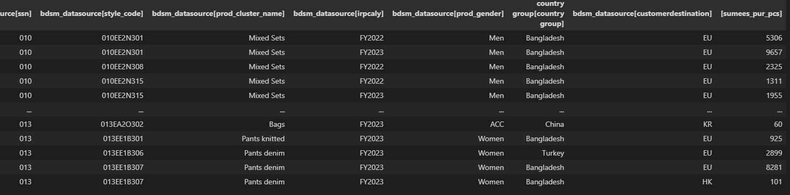

# Python-for-BI-Semantic-Data-Model-Connector

The PowerBI semantic data models can be connected via excel or PowerBI desktop or via Python connector scripts. 
By using Python script, the data can be imported directly and perform data anylicts with Python using pandas or other libraries.

Required information 
1. Dataset ID
2. Login information& Password for PowerBI
3. Client ID
4. Dax query

[main.ipynb](https://github.com/sebsebsebsebtimes4/Python-for-BI-Semantic-Data-Model-Connector/blob/main/main.ipynb)

```
%run PowerBIDataConnector.ipynb
from IPython.display import display

dmc = DataModelCollector(dataset_id='39d72aa7-5e35-4dd1-bd28-9f5903a75881',
                         login='sebastien.hsu@esprit.com',
                         password='Sebtimes11'
                         )

dmc.create_connection()

dmc.get_all_tables()
print(dmc.df_table)

query_str = '''

DEFINE
	VAR __DS0Core = 
		SUMMARIZECOLUMNS(
			'BDSM_DataSource'[SSN],
			'BDSM_DataSource'[Style_Code],
			'BDSM_DataSource'[Prod_Cluster_Name],
			'BDSM_DataSource'[IRPCalY],
			'BDSM_DataSource'[Prod_Gender],
			'Country Group'[Country Group],
			'BDSM_DataSource'[CustomerDestination],
			"SumEES_PUR_PCS", CALCULATE(SUM('BDSM_DataSource'[EES_PUR_PCS]))
		)

	VAR __DS0PrimaryWindowed = 
		TOPN(
			501,
			__DS0Core,
			'BDSM_DataSource'[SSN],
			1,
			'BDSM_DataSource'[Style_Code],
			1,
			'BDSM_DataSource'[Prod_Cluster_Name],
			1,
			'BDSM_DataSource'[IRPCalY],
			1,
			'BDSM_DataSource'[Prod_Gender],
			1,
			'Country Group'[Country Group],
			1,
			'BDSM_DataSource'[CustomerDestination],
			1
		)

EVALUATE
	__DS0PrimaryWindowed
ORDER BY
	'BDSM_DataSource'[SSN],
	'BDSM_DataSource'[Style_Code],
	'BDSM_DataSource'[Prod_Cluster_Name],
	'BDSM_DataSource'[IRPCalY],
	'BDSM_DataSource'[Prod_Gender],
	'Country Group'[Country Group],
	'BDSM_DataSource'[CustomerDestination]
          
'''
```

DataFrame Example



[PowerBIDataConnector.ipynb](https://github.com/sebsebsebsebtimes4/Python-for-BI-Semantic-Data-Model-Connector/blob/main/PowerBIDataConnector.ipynb)
```
import adodbapi
import pandas as pd
import pywintypes

# need to find the datasetID from the PBI workspace or if connecting the dataset from BI sematic model via Excel pivot table, then find it in the data proerty.
# Client ID can also be found in excel.

id = '39d72aa7-5e35-4dd1-bd28-9f5903a75881'

class DataModelCollector:
    def __init__(self,
                 dataset_id= id,
                 export_folder_path='./',
                 auto_connect=True,
                 login=None,
                 password=None
                 ):
        self.dataset_id = dataset_id
        self.export_folder_path = export_folder_path
        self.conn_dict = {'Provider': 'MSOLAP.8',
                          'Integrated Security': 'ClaimsToken',
                          'Persist Security Info': 'True',
                          'Initial Catalog': f'sobe_wowvirtualserver-{self.dataset_id}',
                          'Data Source': 'pbiazure://api.powerbi.com',
                          'MDX Compatibility': '1',
                          'Safety Options': '2',
                          'MDX Missing Member Mode': 'Error',
                          'Identity Provider': 'https://login.microsoftonline.com/common, https://analysis.windows.net/powerbi/api, 929d0ec0-7a41-4b1e-bc7c-b754a28bddcc',
                          'Update Isolation Level': '2'
                          }
        if login is not None and password is not None:
            self.conn_dict = {**self.conn_dict, **{'User ID': login, 'Password': password}}

        self.connection_str = ';'.join([k + '=' + v for k, v in self.conn_dict.items()])

        self.export_file_name = 'tmp'
        self.conn = None
        self.cur = None
        self.data = None
        self.df = pd.DataFrame()
        self.query_str = None
        self.df_table = None

        if auto_connect:
            self.create_connection()

    def create_connection(self, timeout=30):
        self.conn = adodbapi.connect(self.connection_str, timeout)
        self.cur = self.conn.cursor()

    def close_connection(self):
        self.conn.close()

    def __create_data_frame(self):
        # check the set of type of the date col and see whether it has date obj in there
        if isinstance(self.data, list):
            pass  # no data
        else:
            orig_cols = list(self.data.columnNames.keys())
            orig_dat = list(self.data.ado_results)
            orig_dat_type = [set(list(map(type, i))) for i in orig_dat]
            converted_dat = []

            for i, j in zip(orig_dat, orig_dat_type):
                if pywintypes.TimeType in j:
                    converted_dat.append([k.date() if k is not None else '' for k in i])
                else:
                    converted_dat.append(i)
            self.df = pd.DataFrame(converted_dat).transpose()
            self.df.columns = orig_cols

    def get_data_general(self):
        self.df = pd.DataFrame()  # remove previous df
        self.cur.execute(self.query_str)
        self.data = self.cur.fetchall()
        self.__create_data_frame()

    def get_all_tables(self):
        self.query_str = "Select TABLE_NAME from $SYSTEM.DBSCHEMA_TABLES where TABLE_SCHEMA='MODEL' and TABLE_TYPE='SYSTEM TABLE'"
        self.get_data_general()
        self.df_table = self.df.copy()
        return self.df_table

    def get_data_from_table(self, table_name):
        self.query_str = "evaluate '" + f"{table_name}" + "'"
        self.get_data_general()

    def get_data_with_custom_str(self, query_str):
        self.query_str = query_str
        self.get_data_general()

    def get_data_with_txt_file(self, file_full_name):
        with open(file_full_name, 'r') as f:
            self.query_str = ''.join(f.readlines())
        self.get_data_general()

    def export_df(self, export_file_overrider, export_path_overrider=None):
        if export_path_overrider is not None:
            self.export_folder_path = export_path_overrider
        self.export_file_name = export_file_overrider
        self.df.to_csv(self.export_folder_path + self.export_file_name + '.csv', index=None)

print("output successfully")

```


