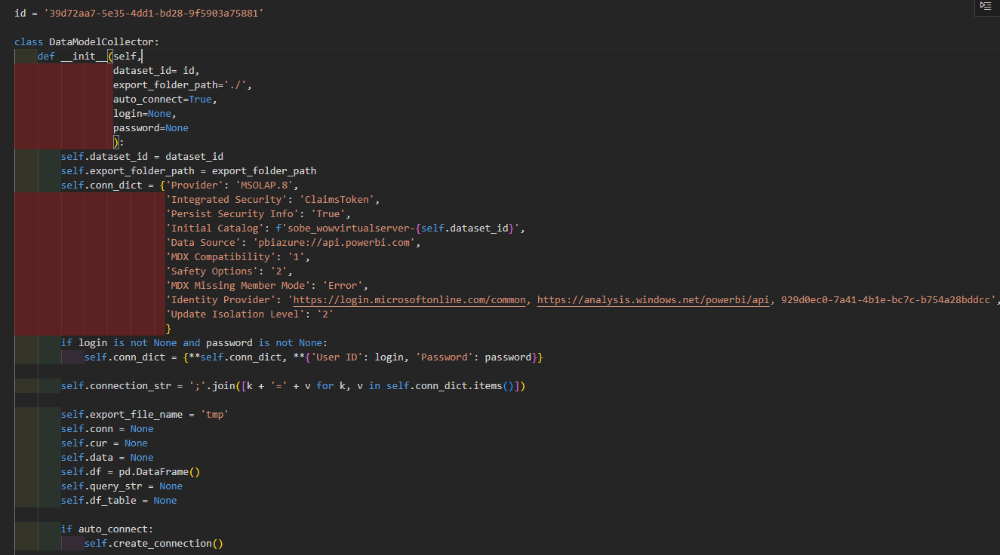

# Python-for-BI-Semantic-Data-Model-Connector

The Power BI semantic data models can be connected via Excel, Power BI Desktop, or Python connector scripts.
By using a Python script, the data can be imported directly and analyzed with Python using Pandas or other libraries.

Required information 
1. Dataset ID
2. Login information& Password for PowerBI
3. Client ID
4. Dax query

[main.ipynb](https://github.com/sebsebsebsebtimes4/Python-for-BI-Semantic-Data-Model-Connector/blob/main/main.ipynb)

```
%run PowerBIDataConnector.ipynb
from IPython.display import display

dmc = DataModelCollector(dataset_id='39d72aa7-5e35-4dd1-bd28-9f5903a75881',
                         login='sebastien.hsu@esprit.com',
                         password='Sebtimes11'
                         )

dmc.create_connection()

dmc.get_all_tables()
print(dmc.df_table)

query_str = '''

DEFINE
	VAR __DS0Core = 
		SUMMARIZECOLUMNS(
			'BDSM_DataSource'[SSN],
			'BDSM_DataSource'[Style_Code],
			'BDSM_DataSource'[Prod_Cluster_Name],
			'BDSM_DataSource'[IRPCalY],
			'BDSM_DataSource'[Prod_Gender],
			'Country Group'[Country Group],
			'BDSM_DataSource'[CustomerDestination],
			"SumEES_PUR_PCS", CALCULATE(SUM('BDSM_DataSource'[EES_PUR_PCS]))
		)

	VAR __DS0PrimaryWindowed = 
		TOPN(
			501,
			__DS0Core,
			'BDSM_DataSource'[SSN],
			1,
			'BDSM_DataSource'[Style_Code],
			1,
			'BDSM_DataSource'[Prod_Cluster_Name],
			1,
			'BDSM_DataSource'[IRPCalY],
			1,
			'BDSM_DataSource'[Prod_Gender],
			1,
			'Country Group'[Country Group],
			1,
			'BDSM_DataSource'[CustomerDestination],
			1
		)

EVALUATE
	__DS0PrimaryWindowed
ORDER BY
	'BDSM_DataSource'[SSN],
	'BDSM_DataSource'[Style_Code],
	'BDSM_DataSource'[Prod_Cluster_Name],
	'BDSM_DataSource'[IRPCalY],
	'BDSM_DataSource'[Prod_Gender],
	'Country Group'[Country Group],
	'BDSM_DataSource'[CustomerDestination]
          
'''
```

DataFrame Example


[PowerBIDataConnector.ipynb](https://github.com/sebsebsebsebtimes4/Python-for-BI-Semantic-Data-Model-Connector/blob/main/PowerBIDataConnector.ipynb)

Connector Script



